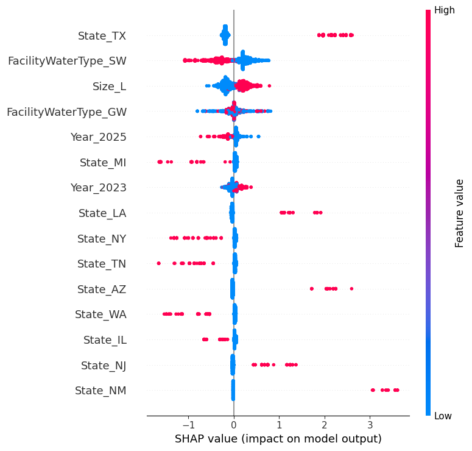
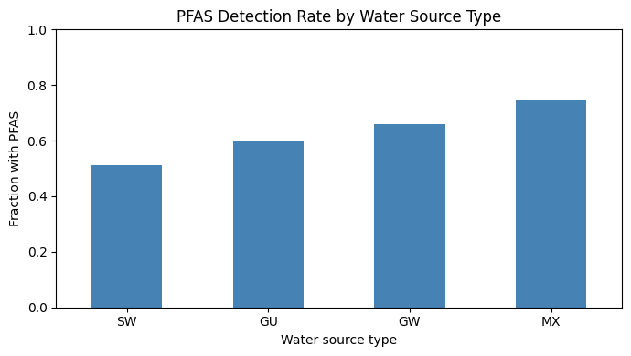
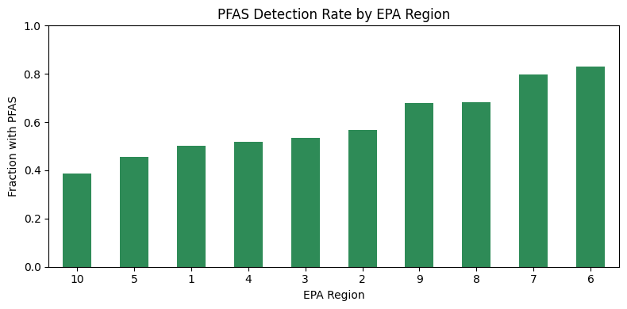
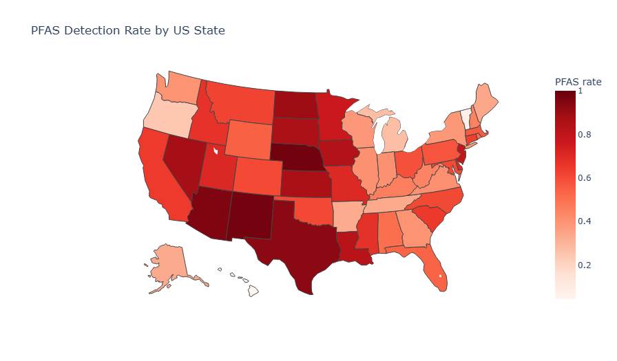

# Predicting PFAS Detection in US Drinking Water (XGBoost + SHAP)

A machine learning analysis of EPA national monitoring data. It predicts whether a public water system has detectable PFAS, looks at what is linked to detection, and examines which specific PFAS chemicals show up most and where.

## Goal

Predict whether a US public water system has detectable PFAS from its size, location, water source, and sampling year, and use SHAP to understand which factors are most associated with detection.

## Data

EPA UCMR 5 (the Fifth Unregulated Contaminant Monitoring Rule), the agency's national PFAS monitoring program covering 2023 to 2025. The raw file holds 1.93 million individual measurements across 10,299 public water systems, tested for 29 PFAS chemicals plus lithium.

## Method

1. Marked each measurement as a detect or a non-detect from the analytical result sign.
2. Reduced the measurements to one verdict per water system: a system counts as PFAS-detected if any of its samples, for any chemical, came back positive.
3. Checked every category column for invalid entries and removed 225 systems with non-state location codes (numeric codes and US territories), keeping the 50 states plus DC. This left 10,074 systems.
4. Built predictors from system size, state, water source type, and sampling year, then one-hot encoded them for modeling.
5. Trained an XGBoost classifier on an 80/20 train and test split.
6. Checked the model with 5-fold cross-validation. The first run gave unstable, low scores because the data is sorted by system ID, which groups states together, so the default unshuffled folds each saw a different set of states. Switching to shuffled, stratified folds fixed this and gave a stable, trustworthy estimate. This step is kept in the notebook because spotting and fixing that issue is part of the analysis.
7. Compared XGBoost against a simple baseline and a logistic regression, so the choice of a more complex model is tested rather than assumed.
8. Used SHAP to see which features drive the model's predictions, and checked those directions against the raw detection rates in the data.
9. Separately looked at which PFAS chemicals are detected most often, nationally and by region.

## Results

About 60% of tested systems had detectable PFAS, so that is the number any model has to beat. The three models compared like this:

| Model | CV macro-F1 | Test accuracy | Precision (PFAS) | Recall (PFAS) |
|-------|-------------|---------------|------------------|---------------|
| Baseline (always predict PFAS) | 0.37 | 0.60 | 0.60 | 1.00 |
| Logistic Regression | 0.665 | 0.688 | 0.725 | 0.772 |
| XGBoost | 0.677 | 0.705 | 0.724 | 0.820 |

The headline number is the cross-validated macro-F1 of about **0.68 (plus or minus 0.01)** for XGBoost, and it matches the held-out test score of 0.68. When the cross-validation score and the test score agree like this, it is a good sign that the number is real and not the result of a lucky split.

Macro-F1 is used instead of plain accuracy because the classes are imbalanced, and macro-F1 gives both classes equal weight. On that measure the model (0.68) is well clear of the baseline (0.37), which is a bigger and more honest gap than a simple accuracy comparison would suggest.

**An honest note on the model choice.** Logistic regression scored 0.665 and XGBoost scored 0.677, a difference of only about 0.01. So a simple linear model captures almost all of the available signal, and XGBoost adds only a small gain here. XGBoost is kept as the main model because it handles feature interactions and pairs naturally with SHAP, but the honest reading is that the extra complexity buys very little on this data.

## What Is Linked to PFAS Detection

SHAP and the raw detection rates agree on the main patterns:

Groundwater and mixed-source systems show higher PFAS rates (66% and 74%) than surface water systems (51%). This fits the idea that PFAS are long-lasting compounds that build up in groundwater rather than washing through surface systems.

Detection varies a lot by region, from 38% in Region 10 (Pacific Northwest) to over 80% in Regions 6 and 7 (south-central and central US).

Larger water systems also show higher PFAS rates than smaller ones.

## Which PFAS, and Where

Beyond whether PFAS is present, the data shows which chemicals show up most. Nationally, the most frequently detected are PFPeA, PFHxA, PFBS, and PFBA, with PFOS and PFOA, the two most studied PFAS, both in the top six.

The leading chemical also changes by region: PFOA in the northeast, PFBA across the central US, and PFBS and PFHxS elsewhere. This points to different contamination sources in different regions, since different PFAS come from different industrial and firefighting-foam uses. Note that "most frequently detected" means how often a chemical was reported, not its concentration or its health risk.

## Honest Limitations

- The model uses only four broad system-level features. Richer inputs, such as actual population served, distance to industrial sites, or land use, would likely help but were not in this file.
- A simple logistic regression nearly matched XGBoost, so the signal that these features carry is mostly simple. The model works, but the features have a limited ceiling.
- The findings are associations, not causes. A region having more PFAS does not mean the location causes contamination; it more likely reflects industrial history and testing patterns.
- Adding sampling year improved the score by only about one point, another sign the model is near its ceiling given the available features. The limit is the data, not the model.
- "Most frequently detected" counts detections; it is not a measure of concentration or risk.
- Lithium was included by mistake in an early version of the chemical analysis, then caught and removed. UCMR 5 monitors 29 PFAS plus lithium, and lithium is not a PFAS.

## Tools

Python, pandas, XGBoost, SHAP, scikit-learn, matplotlib, plotly (Google Colab)

## Acknowledgment

This project was completed with guidance from Claude (Anthropic) for code explanation, debugging support, and technical concepts during development. All analysis decisions, data interpretation, and verification were done by the author, who can explain each step of the notebook.
